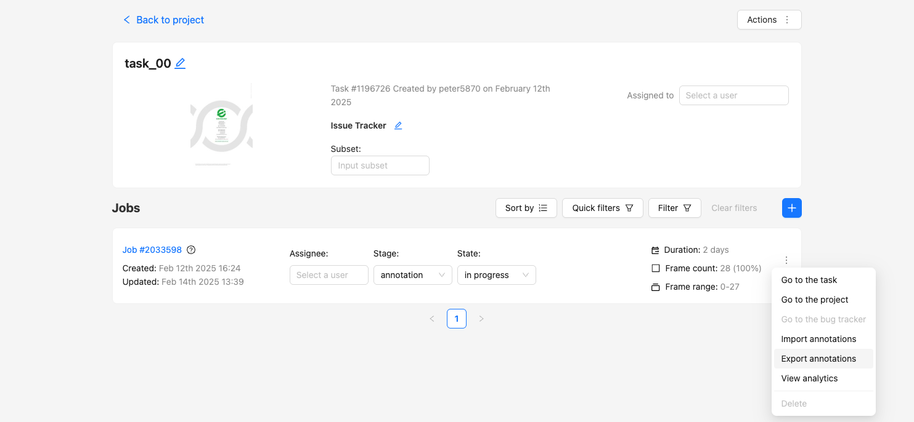

# Creating Groundtruth dataset using the CVAT annotation tool

## Prerequisites: create dataset in parquet

To start creating ground-truth, you first need to have a dataset in parquet format. This can be done in different ways. 

The first way is to use an existing dataset (eg dpbench), which has potentially pre-annotated tables, formulas, etc. Hence you can run the create script of that particular benchmark.

```sh
poetry run python ./docs/examples/benchmark_dpbench.py
```

Another way is to create it from PDF or PNG files. In this case, simply run the following scripts,

```sh
poetry run python ./docling_eval/benchmarks/cvat_annotation/create_dataset_from_pdfs.py -h
usage: create_dataset_from_pdfs.py [-h] -i INPUT_DIR -o OUTPUT_DIR -b BUCKET_SIZE

Process input and output directories and a pre-annotation file.

options:
  -h, --help            show this help message and exit
  -i INPUT_DIR, --input_dir INPUT_DIR
                        Path to directory with pdf's
  -o OUTPUT_DIR, --output_dir OUTPUT_DIR
                        Path to the output directory containing the dataset.
  -b BUCKET_SIZE, --bucket-size BUCKET_SIZE
                        Numbers of documents in the bucket.
```

## Pre-annotation with Docling

Once you have run the Prerequisites, you can create the files you need to upload to [CVAT](https://www.cvat.ai/). These files will be created using the `preannotate.py` script,

```sh
poetry run python docling_eval/benchmarks/cvat_annotation/preannotate.py -h
usage: preannotate.py [-h] -i INPUT_DIR -o OUTPUT_DIR -b BUCKET_SIZE

Process input and output directories and a pre-annotation file.

options:
  -h, --help            show this help message and exit
  -i INPUT_DIR, --input_dir INPUT_DIR
                        Path to the input dataset directory with parquet files.
  -o OUTPUT_DIR, --output_dir OUTPUT_DIR
                        Path to the output directory.
  -b BUCKET_SIZE, --bucket-size BUCKET_SIZE
                        Numbers of documents in the bucket.
```

In essence, this will read the parquet files and set up a new directory structure (designated output) that has the following layout,

```sh
./benchmarks/<output-dir>
├── cvat_annotations
│   ├── xmls
│   └── zips
├── cvat_description.json
├── cvat_overview.json
├── cvat_bins
├── cvat_tasks
│   └── task_00
├── datasets
│   ├── test
│   └── train
├── html_annotations
├── html_comparisons
├── json_annotations
├── json_groundtruth
├── json_predictions
└── page_imgs
```

The definition of the annotation items (DocItemLabel and Lines) can be found in `cvat_description.json`. All the other data you need is in the `cvat_tasks`,

```
tree ./benchmarks/layout_bench_cvat/cvat_tasks
./benchmarks/layout_bench_cvat/cvat_tasks
├── task_00
│   ├── doc_03f0ba705b60a81144dd4669945f41e9ce1d5a399ee671f7e95ee15a73f3388b_page_000001.png
│   ├── doc_041e0f3a476814054ccc97b9dcecd6e46fef2a687297cf2bcbe0f3d1d42c543c_page_000001.png
...
│   └── doc_f85bda78041c552c58faa1c83d9bb5cf48265fbe96330c4476e4b75725c0c71a_page_000001.png
└── task_00_preannotate.xml
``` 

Here we have,

1. the page-images in `task_<xx>`
2. the annotations for each page-image in xml

## Online Annotation


<table>
<tr>
<td style="width: 20%;">To start annotating, go to the [CVAT](cvat.ai) and create a new project,</td>
<td style="width: 80%;"></td>
</tr>
<tr>
<td>Next, you give the project a name and upload the content of `cvat_description.json` into the Raw labels.</td> 
<td></td>
</tr>
<tr>
<td>Next, click `Submit & Open`. This will open a new window in which you can create new tasks</td> 
<td></td>
</tr>
<tr>
<td>Next you upload the images you want to annotate from the `cvat_tasks/task_<xx>` and click `Submit & Open`.</td>
<td></td>
</tr>
<tr>
<td>Next, you can upload the pre-annotations for the taks,</td>
<td></td>
</tr>
<tr>
<td>and you upload the CVAT annotations in xml,</td>
<td></td>
</tr>
<tr>
<td>Finally, you are ready to annotate (click on `#Job <xxx>`) and the annotation window opens up,</td>
<td></td>
</tr>
<tr>
<td>Make sure you adjust the bounding boxes, labels and add the reading-order line. The Reading order is simply a line of points, that have to fall inside the bounding-boxes,</td>
<td>

</td>
</tr>
</table>

## Packaging the annotations into new dataset

After you have annotated all images, you can export the annotations,



You move the zip file into `cvat_annotations/zips` and then run the create script,

```sh
poetry run python docling_eval/benchmarks/cvat_annotation/create.py -h
usage: create.py [-h] -i INPUT_DIR

Create new evaluation dataset using CVAT annotation files.

options:
  -h, --help            show this help message and exit
  -i INPUT_DIR, --input_dir INPUT_DIR
                        Path to the input directory
```

This should do all the heavy lifting for you. It is good to verify that all went well by inspecting the `html_comparisons` directory. The newly created dataset will be stored in the `dataset` with `test` and `train` subdirs. Evaluations cna then be run directly on the `dataset/test` directory.
